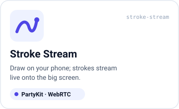
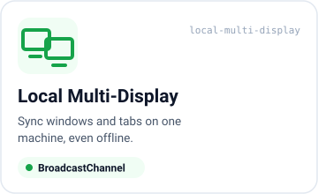

<p align="center">
  <a href="https://takaoumehara.github.io/snap-pair-skill/"><strong>📖 ドキュメントサイト →  takaoumehara.github.io/snap-pair-skill</strong></a>
  &nbsp;·&nbsp;
  <a href="https://takaoumehara.github.io/snap-pair-skill/demo.html">▶ 2タブで試せるライブデモ</a>
</p>

<p align="center">
  <a href="https://takaoumehara.github.io/snap-pair-skill/"></a>
</p>

<p align="center">
  <a href="https://www.npmjs.com/package/snap-pair-core"></a>
  
  
  
  
  
</p>

<p align="center">
  <a href="https://github.com/takaoumehara/snap-pair-skill/blob/main/README.md">English</a> · <b>日本語</b> · <a href="https://github.com/takaoumehara/snap-pair-skill/blob/main/README.zh-CN.md">简体中文</a> · <a href="https://github.com/takaoumehara/snap-pair-skill/blob/main/README.es.md">Español</a> · <a href="https://github.com/takaoumehara/snap-pair-skill/blob/main/README.ko.md">한국어</a>
</p>

# snap-pair

**snap-pairは、マルチスクリーンのインタラクティブなWeb体験をつくるためのDevToolです。**
スマートフォンがコントローラーに、大画面がホストになります。参加者はいつも使っているブラウザでQRコードをスキャンするか、6桁のPINを入力するだけでペアリングでき、インストールは一切不要です。その場にいるすべてのデバイスが、入力と状態をリアルタイムに共有します。

プロダクト（クイズ、お絵描きウォール、ゲーム、ライトショー、ショールームなど）はご自身で用意し、その上に構築していただく形です。snap-pairは、ペアリング、リアルタイム通信（Transport）、そしてつまずきやすいスマートフォン側の細かな処理を引き受けます。

- **ペアリング：** QRコード、6桁のPIN、またはタブ間のローカルブロードキャスト。
- **Transport：** Firebase Realtime Database、PartyKit、WebRTC DataChannel、BroadcastChannelを、すべて1つの`Transport` APIで扱えます。
- **クライアントユーティリティ：** 画面のスリープ防止（Wake Lock）、デバイスの向き・モーション（iOSの許可ダイアログを含む）、画面の向きのロック。
- **7種類のUXプリセット**と、動作するアプリを生成するCLI（`npx snap-pair init`）。

npmパッケージ名は **`snap-pair-core`**（MIT）です。

## 目次

- [クイックスタート](#クイックスタート)
- [デバイスの接続方法](#デバイスの接続方法)
- [Transportの選び方](#transportの選び方)
- [プリセット](#プリセット)
- [CLI](#cli)
- [API概要](#api概要)
- [すべての人へ（非エンジニア向け）](#すべての人へ非エンジニア向け)
- [Firebaseのセットアップ](#firebaseのセットアップ)
- [セキュリティモデル](#セキュリティモデル)
- [AIエージェントスキル](#aiエージェントスキル)
- [よくある質問](#よくある質問)
- [ロードマップ](#ロードマップ)

---

## クイックスタート

```bash
# 1. 対話型ウィザードで新しいアプリを生成（英語/日本語対応）
npx snap-pair init

# 2. または既存のReactアプリにライブラリを追加
npm i snap-pair-core
```

<details>
<summary>pnpm / yarn / bun</summary>

```bash
pnpm add snap-pair-core
yarn add snap-pair-core
bun add snap-pair-core
```

</details>

任意のピア依存関係として、`qrcode`（`HostHUD`でのQRコード描画）と`partysocket`（より堅牢なPartyKitソケット）があります。どちらも必須ではありません。

最小構成のマルチスクリーンアプリなら、サーバーは一切不要です。同じブラウザの2つのタブをPINでペアリングできます。

```ts
import { BroadcastChannelTransport } from 'snap-pair-core';

// Tab 1: the host (big screen)
const host = new BroadcastChannelTransport({ pairing: 'pin' });
await host.connect();
const { pairing } = await host.createRoom({ initialState: { strokes: [] } });
console.log('PIN', pairing.pin); // e.g. '042917'
host.onMessage((m) => draw(m.payload)); // m.type === 'stroke'

// Tab 2: the controller
const ctrl = new BroadcastChannelTransport({ pairing: 'pin' });
await ctrl.connect();
await ctrl.joinRoom('042917');
await ctrl.broadcast('stroke', { x: 0.42, y: 0.17 });
```

`BroadcastChannelTransport`を`PartyKitTransport`や`FirebaseTransport`に差し替えるだけで、同じコードがインターネット越しに動作します。
[2つのタブでライブデモを試す →](https://takaoumehara.github.io/snap-pair-skill/demo.html)

---

## デバイスの接続方法

<p align="center">
  
</p>

| 方式 | ゲストの操作 | 対応Transport | ヘルパー |
|---|---|---|---|
| **QRコード** | カメラでスキャン。URLに`?room=`または`?pin=`が含まれます | すべてのTransport | `buildPairingJoinUrl`, `parseJoinUrl`, `useQrRenderer`, `HostHUD` |
| **6桁のPIN** | `042 917`のように入力（全角数字やハイフンも正規化されます） | PartyKit, WebRTC, BroadcastChannel | `generatePin`, `normalizePin`, `isValidPin`, `verifyPin` |
| **ルームコード** | `ABC 234`のような6文字のコードを入力（見間違えやすい文字は使いません） | すべてのTransport（Firebaseのデフォルト） | `normalizeRoomCode`, `generateRoomCode` |
| **ブロードキャスト** | 同じマシンで別のタブ／ウィンドウを開く | BroadcastChannel | `BroadcastChannelTransport` |

ホスト側の表示は、1つのコンポーネントですべてまかなえます。

```tsx
import { HostHUD, useQrRenderer } from 'snap-pair-core';

const renderQr = useQrRenderer(); // undefined if `qrcode` isn't available, so the HUD shows the code only
<HostHUD pairing={pairing} renderQr={renderQr} peerCount={peers.length} status={status} />;
```

---

## Transportの選び方

<p align="center">
  
</p>

<p align="center">
  
</p>

| 必要なもの | 使うもの | 理由 |
|---|---|---|
| 大規模な公開ルーム（最大300人）、サーバー側での参加チェック、永続化 | **Firebase**（デフォルト） | Cloud Functionsがすべてのゲストの参加を受け入れ、RTDBルールでメンバーが書き込める範囲を制限します |
| インターネット越しのスマートフォンからの低遅延入力、シンプルなデプロイ | **PartyKit** | 小さなWebSocketリレー（[`examples/partykit/`](./examples/partykit/)）で、ルームはホストのブラウザが管理します |
| 最小のレイテンシ（お絵描き、ゲーム、モーション） | **WebRTC** | ピアツーピアのDataChannel。シグナリングはPartyKit（またはメッセージング対応の任意のTransport）上で行います |
| **1台**のマシン上の複数ウィンドウ／ディスプレイ、オフライン | **BroadcastChannel** | ネットワークもサーバーもアカウントも不要です |

4つすべてが同じ`Transport`インターフェース（`connect`、`createRoom`、`joinRoom`、`setState`、`send`、`broadcast`、`onMessage`、`onPeers`、`onState`、`onStatus`など）を実装しているため、切り替えは1行の変更で済みます。UIを状況に応じて縮退させたい場合は、`transport.capabilities`（`messaging`、`presence`、`serverAuthoritativeJoin`）を確認してください。たとえばFirebaseには一時的なメッセージング機能がない（`messaging: false`）ため、Firebase上で動くプリセットは共有stateを通じて入力を送ります。

```ts
import { PartyKitTransport, WebRTCTransport, FirebaseTransport } from 'snap-pair-core';

const party = new PartyKitTransport({ host: 'my-relay.me.partykit.dev', pairing: 'pin' });
const p2p = new WebRTCTransport({ signaling: party }); // DataChannel star, host in the middle
const fb = new FirebaseTransport({ db, auth, functions }); // server-authoritative rooms
```

---

## プリセット

すぐに使える7種類のUXパターンです。それぞれに`npx snap-pair init`で生成できるテンプレートと、推奨Transportが用意されています。

<table>
  <tr>
    <td width="33%" align="center"></td>
    <td width="33%" align="center"></td>
    <td width="33%" align="center"></td>
  </tr>
  <tr>
    <td align="center"></td>
    <td align="center"></td>
    <td align="center"></td>
  </tr>
  <tr>
    <td align="center"></td>
    <td colspan="2" valign="middle">
      <b>プリセットID</b>（CLIおよび<code>snap-pair.config.json</code>で使用）：<br><br>
      <code>stroke-stream</code> · <code>particle-blast</code> · <code>type-throw</code> · <code>room-quiz-poll</code> · <code>virtual-controller</code> · <code>motion-sensor</code> · <code>local-multi-display</code>
    </td>
  </tr>
</table>

| プリセット | id | ホストに表示されるもの | スマートフォンが送るもの | Transport |
|---|---|---|---|---|
| Stroke Stream | `stroke-stream` | 共有キャンバス | ポインターのストローク | PartyKit · WebRTC |
| Particle Blast | `particle-blast` | パーティクルフィールド | タップ／スワイプ | WebRTC · PartyKit |
| Type Throw | `type-throw` | ワードウォール | 短いテキスト | Firebase · PartyKit |
| Room Quiz / Poll | `room-quiz-poll` | 問題とリアルタイムの結果 | 回答 | Firebase |
| Virtual Controller | `virtual-controller` | ゲーム画面 | 十字キー／ボタンの状態 | WebRTC · PartyKit |
| Motion / Sensor | `motion-sensor` | 傾きで動くシーン | 向き／モーション | WebRTC · PartyKit |
| Local Multi-Display | `local-multi-display` | 同期されたウィンドウ | ウィンドウの状態 | BroadcastChannel |

---

## CLI

```bash
npx snap-pair init
```

ウィザードは英語と日本語に対応しており（OSの言語設定から自動判定）、4通りの入り口を用意しています。プロジェクトの考え方に合うものを選んでください。

| 入り口 | 答えること | 得られるもの |
|---|---|---|
| **1. UXから選ぶ** | 7つのプリセットのうち、どれがしっくりくるか | そのプリセットのテンプレートと推奨Transport |
| **2. アーキテクチャから選ぶ** | 画面とスマートフォンの台数、同じ場所か遠隔か、永続化が必要か | 条件に合ったTransportとペアリング方式 |
| **3. 技術スタックから選ぶ** | すでに使っているもの（Firebase、PartyKit、素のWebRTC、何もなし） | お使いのスタックに合わせたセットアップ |
| **4. 言葉で説明する** | 「ステージの画面で観客が投票する」のような、普段の言葉での一文 | 受け入れることも変更することもできる、ルールベースの推奨構成 |

どの入り口も、最後に **`snap-pair.config.json`**（プリセット、Transport、ペアリング方式）を書き出し、対応するテンプレートを生成して完了します。選択を変えたいときは、いつでもコマンドを再実行してください。

---

## API概要

すべて`snap-pair-core`からエクスポートされています。

### React: `useSnapPair`

```tsx
import { useSnapPair } from 'snap-pair-core';

// Firebase (default): server-assisted rooms
const sp = useSnapPair({ db, auth, functions, guest: { id: '', name: 'Ada' }, maxPlayers: 8 });

// Any other transport (Phase 3)
const sp = useSnapPair({ transport: party, guest: { id: '', name: 'Ada' } });

const { room, authReady, createRoom, joinRoom, updateState, updateOwnPlayer, updateRoomStatus, leaveRoom } = sp;
```

Firebaseを使う場合は、`createRoom(initialState)`や`joinRoom(code)`を呼び出す前に`authReady`を待ってください。メンバーは、共有される`state`、自分自身の`name`、`connected`、`lastSeenAt`を更新できます。ルームのステータスを変更できるのはホストのみです。

### Transport

| エクスポート | 説明 |
|---|---|
| `Transport` | 抽象基底クラス：`connect` / `disconnect`、`createRoom` / `joinRoom` / `leaveRoom`、`setState`、`send` / `broadcast`、冪等な購読解除関数を返す`on*`系の購読、そして`capabilities` |
| `FirebaseTransport`, `FirebaseRoomStore` | RTDB＋呼び出し可能なCloud Functions。`serverAuthoritativeJoin: true` |
| `PartyKitTransport` | オプション：`host`、`party`、`pairing`、`socketFactory`（バンドルしたアプリでは`partysocket`を注入）、`connectTimeoutMs`。バックオフ付きの`WebSocket`にフォールバックします |
| `WebRTCTransport` | オプション：`signaling`（メッセージング対応の任意のTransport）、`iceServers`（デフォルト：公開STUNサーバー1つ）、`connectTimeoutMs` |
| `BroadcastChannelTransport` | 同一オリジンのタブ／ウィンドウ間。`isBroadcastChannelSupported()` |
| `RelayTransport` | 上記3つの背後にある、ホスト権威型の共通エンジン。共通オプション：`pairing: 'code' \| 'pin'`、`maxPlayers`、`admit(peer)`、`namespace`、`joinBaseUrl`、`heartbeatMs`、`peerTimeoutMs`、`allowGuestState` |

### ペアリング

| エクスポート | 説明 |
|---|---|
| `generatePin()`, `normalizePin()`, `isValidPin()`, `formatPin()`, `verifyPin()` | 偏りのない6桁のPIN（`crypto.getRandomValues`）と、定数時間での照合 |
| `deriveRoomId()`, `deriveChannelName()` | コードやPINをハッシュ化し、名前空間付きのルームキーに変換。プレーンHTTPのLANオリジンでも動作します |
| `buildPairingJoinUrl()`, `parseJoinUrl()` | `?pin=` / `?room=`の参加リンク |
| `useQrRenderer()`, `createQrRenderer()`, `toQrDataUrl()`, `loadQrLib()` | 任意の`qrcode`パッケージによるQRコード描画 |
| `generateRoomCode()`, `normalizeRoomCode()`, `ROOM_CODE_ALPHABET` | 見間違えやすい文字を含まない6文字のルームコード |

### クライアントユーティリティ

| エクスポート | 説明 |
|---|---|
| `useWakeLock(enabled)`, `createWakeLock()`, `isWakeLockSupported()` | コントローラーの画面を点灯したまま保ちます。タブが再表示されると自動で再取得します |
| `needsPermission()`, `requestOrientationPermission()` | iOS 13以降の許可ダイアログ。タップのハンドラーから呼び出してください。`'granted' \| 'denied' \| 'unsupported'`を返します |
| `subscribeOrientation()`, `subscribeMotion()` | `alpha/beta/gamma`と加速度の値 |
| `lockScreenOrientation()`, `unlockScreenOrientation()`, `getScreenOrientation()` | 対応環境での画面の向きのロック |

```ts
button.onclick = async () => {
  if (needsPermission() && (await requestOrientationPermission()) !== 'granted') return;
  const stop = subscribeOrientation(({ beta, gamma }) => transport.broadcast('tilt', { beta, gamma }));
};
```

すべてのクライアントユーティリティは呼び出し時に機能検出を行い、非対応の環境では何もしない（no-op）ように縮退するため、SSR中にインポートしても安全です。

### コンポーネント

| エクスポート | 説明 |
|---|---|
| `HostHUD` | ホスト側のペアリングパネル：QRコード（`renderQr`経由）、ルームコード、PIN、コピーボタン付きの参加リンク、接続人数、ステータス。すべての文言は`labels`で上書きできます |
| `ControllerWrapper` | ゲスト側のシェル：コントローラーの周囲に、Wake Lock、モーション許可ボタン、画面の向きのロック、再接続UIを提供します（Phase 3） |

<details>
<summary><b>Firebaseのデータレイアウトとルームサーバー</b></summary>

```text
pairingCodes/{code}                 # Admin SDK only
roomMembers/{roomId}/{uid}: true    # Admin SDK only; client cannot read/write
roomCreationLimits/{uid}            # Admin SDK only; fixed-hour create quota
rooms/{roomId}/meta
rooms/{roomId}/players/{uid}
rooms/{roomId}/state
rooms/{roomId}/joinState            # Admin SDK only
```

- 呼び出し可能なCloud Functions（`functions/src/`）：`createSnapRoom`、`joinSnapRoom`、およびスケジュール実行される`cleanupExpiredData`。
- セキュリティルール（`database.rules.json`）：メンバーシップに基づく読み取り制限と、範囲を限定したクライアント書き込み。ルーム全体への広範な書き込みは許可されません。
- `state`は意図的に汎用的な設計になっており、プロダクト固有のスキーマの検証や、ペイロードサイズ・書き込み頻度の制限は行いません。各プロダクトは、本番運用の前に検証、ペイロード制限、スロットリングを必ず追加してください。

設計メモ：[docs/plan-phase1.md](./docs/plan-phase1.md)、
[docs/plan-phase2.md](./docs/plan-phase2.md)。

</details>

---

## すべての人へ（非エンジニア向け）

**これは何ですか？** 多くの人のスマートフォンを、1つの共有画面に瞬時に参加させる仕組みです。全員がいつも使っているブラウザでQRコードをスキャンする（または短いコードを入力する）だけで、アプリのダウンロードは不要です。各自のスマートフォンが、ライブで同期された1つの体験の一部になります。

**どんな人向けですか？** **イベント、会場、授業、配信、ショールーム、展示会**を運営していて、来場者に自分のスマートフォンで参加してもらいたい方、そしてそうした体験を作る**エンジニアやAIビルダー**の方です。

**何を作れますか？** 大画面でのライブ投票、アンケート、クイズ。グループのチェックリストや「全員準備完了」の確認。観客のリアクション、予想ゲーム、共同お絵描き。スマートフォンを使った同期ライトショー。「1つの共有画面＋多数のスマートフォン＋即座の結果」というあらゆる瞬間です。

### 1つ選んでください

この3つは同じ工程の順番ではなく、それぞれ別々の道です。「今まさにやりたいこと」に合う1つを選んでください。

| | **A. とにかく動くものを見る** | **B. AIに自分のアプリを作ってもらう** | **C. ソースコードを直接触る** |
|---|---|---|---|
| **こんな人向け** | 「2分で動いているところを見たい」 | 「コードを書かずに自分専用のアプリが欲しい」 | 「エンジニアで、ソースを読み書き・改造・貢献したい」 |
| **インストールするもの** | 何も無し | AIコーディングツール1つ | AIコーディングツール **＋** Git/Node.js |
| **ダウンロードするもの** | 何も無し（またはHTMLファイル1つ） | **何も無し**：AIがWeb上の指示書を直接読み込みます | リポジトリ |
| **クレジットカードは必要？** | 不要 | バックエンドによる（[Firebaseのセットアップ](#firebaseのセットアップ)を参照） | バックエンドによる |
| **他の人とリンクを共有できる？** | 同じブラウザ／同じネットワーク内 | できる（デプロイ後） | できる（デプロイ後） |
| **詳細** | [パスA](#パスaとにかく動くものを見る) | [パスB](#パスbaiに自分のアプリを作ってもらう) | [パスC](#パスcソースコードを直接触る) |

#### パスA：とにかく動くものを見る

- **今すぐブラウザで：** [ライブデモ](https://takaoumehara.github.io/snap-pair-skill/demo.html)を2つのタブで開いてください。一方がホストになってPINを表示するので、それをもう一方に入力して描いてみましょう。準備は一切不要です。
- **2台のスマートフォンで：** [`examples/snap-pair-lite.html`](./examples/snap-pair-lite.html)をダウンロードして開き、別のデバイスでQRコードをスキャンしてください。無料のFirebase Sparkプラン上で動く固定の〇×ゲームのデモで、クレジットカードは不要です（[`examples/README.md`](./examples/README.md)を参照）。

#### パスB：AIに自分のアプリを作ってもらう

このリポジトリをダウンロードしたりcloneしたりする必要は**ありません**。2つの小さな道具（MCPサーバー）に接続し、このプロジェクトの作り方の説明書をWeb上から読み込むようAIに指示するだけで十分です。

**必要なもの：** コマンドを実行したりWebページを取得したりできるAIコーディングツール1つ（Claude Code、Cursor、Codex、Gemini CLIなど）。まだ持っていない場合は、次のどれか1つを選んでください：[Cursor](https://cursor.com)（AIが内蔵されたエディター）、**Claude Code**（VS Code拡張機能、または[claude.com/code](https://claude.com/code)から入手できるCLI）、または **Codex** / **Gemini CLI**。

1. AIツールで、任意のフォルダでチャットを開きます（空のフォルダで構いません）。
2. 次の文章をそのまま貼り付けます（英語のままで問題ありません。最後の［］の中だけ、作りたいものを日本語で書き換えても大丈夫です）。

   ```
   Fetch https://raw.githubusercontent.com/takaoumehara/snap-pair-skill/main/SKILL.md
   and use it as your build instructions.

   Connect these two MCP servers if they aren't connected yet:
   - firebase: npx -y firebase-tools@latest mcp
   - snap-pair-provisioner: npx -y snap-pair-provisioner

   Then help me build: [describe what you want, e.g. "a live quiz game where
   guests join by QR code and answer on their phones"].
   ```

3. AIからの質問に順に答えていきます。Firebaseにどのgoogleアカウントを使うかを聞かれ、どこかの時点で一度きりのサインイン用リンクが表示されます。この1クリックだけが唯一の手作業で、アカウントの安全のために意図的に自動化していません。

お使いのツールがWebページを取得できない場合は、[`SKILL.md`](./SKILL.md)だけをダウンロードし、その中身をチャットに貼り付けてください。

#### パスC：ソースコードを直接触る

```bash
git clone https://github.com/takaoumehara/snap-pair-skill.git
cd snap-pair-skill
npm install
npm test
```

そのあと、[API概要](#api概要)と[`docs/`](./docs/)内の設計メモを読んでください。

---

## Firebaseのセットアップ

Firebase Transportを使う場合にのみ必要です。PartyKit、WebRTC、BroadcastChannelはFirebaseを一切使いません。

| 目的 | 使うもの | クレジットカード | URLで他の人が参加できるか |
|---|---|---|---|
| 学習・実験、子どもに構築・テストさせる | **Firebaseエミュレーター**（自分のPC上で動作） | **不要** | いいえ（ローカルのみ） |
| 無料の公開デモ、オープンなルール、少人数 | **Sparkプラン**＋Liteモード（[`examples/`](./examples/)） | **不要** | はい（最大100同時接続） |
| サーバー側でチェックされるルームに実際のゲストを招く | **Blazeプラン** | **必要** | はい |

### 1. エミュレーター：無料、カード不要、ローカルのみ

```bash
npm install
npm --prefix functions install
npm --prefix functions run build
npx firebase-tools emulators:start --only auth,database,functions
```

### 2. Spark（無料）：できること・できないこと

Sparkプランはカード不要で、Firebase Hostingで公開サイトを提供でき、Realtime Databaseも **最大100同時接続** という上限つきで利用できます。**ただし、SparkではCloud Functionsをデプロイできません。** snap-pairのセキュアモードは、ルームの作成と参加をCloud Functionsに依存しています。SparkはLiteモードで使うか、別のTransportを選んでください。

### 3. Blaze（従量課金）：セキュアモードに必須（カードが必要）

Blazeでも無料枠は維持されており（**月あたり約200万回の関数呼び出し**、RTDBは最大20万同時接続）、それを超えた分のみ課金されるため、小規模なイベントであれば無料で済むことが多いです。ただし、有効化するにはカードの登録が必須です。

```bash
npm --prefix functions run build
firebase use YOUR_EXISTING_PROJECT
firebase deploy --only functions
firebase deploy --only database
```

どちらの呼び出し可能関数もFirebase App Checkを強制します。実際のプロジェクトに対してローカル開発を行う場合はデバッグトークンを設定し、デプロイ済みの呼び出し可能関数では強制を無効化しないでください。Firebaseコンソール → Usage and billing（使用量と請求）で**必ず予算アラートを設定してください**（アラートは通知するだけで、課金の上限を強制するものではありません）。

パスBのMCPサーバーが、プロジェクトの作成、サービスの有効化、`.env`の書き込みまで代わりに行います。自動化される部分と一度きりの手作業として残る部分については、[`SKILL.md`](./SKILL.md#firebase-setup-mcp-automation-vs-manual)を参照してください。

---

## セキュリティモデル

- **ペアリングコードはルームの所在を示すものであり、パスワードではありません。** QRコード、ルームコード、PINは待ち合わせのための目印として扱ってください。
- **Firebase（セキュアモード）** はサーバー権威型です。Firebase Authが各ブラウザを識別し、Cloud Functionsがルームの作成と参加者の受け入れを行い、RTDBルールにより、受け入れ済みのメンバーだけが限定された範囲のフィールドを読み取り・更新できます。ID、ロール、メンバーシップ、定員、ペアリングコード、`joinState`はサーバー側だけで管理されます。
- **PartyKit、WebRTC、BroadcastChannel** はホスト権威型です。ルームを作成したブラウザが参加者リストと状態を管理し、サーバー側でピアを受け入れる仕組みはありません（`capabilities.serverAuthoritativeJoin === false`）。参加の制御には`admit(peer)`と`maxPlayers`を使ってください。ルームキーはハッシュ化・名前空間化されるため、生のPINがURLやリレーのログに現れることはありません。
- 6桁のPINは10⁶通りしかありません。公開リレーではレート制限を追加し（[`examples/partykit/`](./examples/partykit/)を参照）、機密性の高い用途にPINだけを使うのは避けてください。
- **決済**はこのプロジェクトの対象外です。プロダクトで決済が必要な場合は、メンバーシップチェックとプロバイダーのWebhook検証を備えた、別の信頼されたサーバー連携を追加してください。

---

## AIエージェントスキル

[`SKILL.md`](./SKILL.md)を使うと、AIコーディングエージェントが正しいsnap-pair連携を生成し、適切なTransportとプリセットを選べるようになります。エージェントには次のraw URLを指定してください。

```
https://raw.githubusercontent.com/takaoumehara/snap-pair-skill/main/SKILL.md
```

または、エージェントのスキルディレクトリにコピーしてください。非公開入力・集計結果の一括公開・コミットメント閾値パターンについては、[`references/one-room-one-decision.md`](./references/one-room-one-decision.md)を参照してください。

---

## よくある質問

<details>
<summary><b>ゲストはアプリをインストールする必要がありますか？</b></summary>

いいえ。ゲストはQRコードをスキャンするかコードを入力して、普段使っているブラウザでURLを開くだけです。
</details>

<details>
<summary><b>どのTransportから始めればよいですか？</b></summary>

1台のマシンで試作するならBroadcastChannel。インターネット越しのスマートフォンで低遅延を求めるならPartyKit（最小のレイテンシが必要になったら後からWebRTCを追加）。参加をサーバー側でチェックする必要がある大規模な公開ルームならFirebaseです。または、`npx snap-pair init`を実行してウィザードに決めてもらうこともできます。
</details>

<details>
<summary><b>クレジットカードは必要ですか？</b></summary>

BroadcastChannel、Firebaseエミュレーター、Firebase SparkのLiteモードでは不要です。Firebaseのセキュアモードにはカード登録が必要なBlazeプランが必要ですが、小規模なイベントであれば通常は無料枠内に収まります。PartyKitには独自の無料枠があります。
</details>

<details>
<summary><b>1つのルームに何人まで参加できますか？</b></summary>

Firebaseのセキュアなルームは最大300人の参加者を想定して設計されています。リレー系のTransportでは、`maxPlayers`と、ホストのブラウザが処理できる接続数によって上限が決まります。WebRTCはホストを中心としたスター型で接続するため、少人数のグループに最も適しています。
</details>

<details>
<summary><b>iPhoneでモーションが動かないのはなぜですか？</b></summary>

iOS 13以降では、タップをきっかけにした許可ダイアログが必要です。クリックハンドラーから`requestOrientationPermission()`を呼び出してください（または、ボタンを自動で追加してくれる`ControllerWrapper`を使ってください）。ページはHTTPSで配信されている必要があります。
</details>

<details>
<summary><b>Reactなしでも使えますか？</b></summary>

はい。Transport、ペアリングのヘルパー、クライアントユーティリティは素のTypeScriptです。Reactが必要なのは`useSnapPair`、`useWakeLock`、`useQrRenderer`、`HostHUD`、`ControllerWrapper`だけです。[ライブデモ](https://takaoumehara.github.io/snap-pair-skill/demo.html)は素のJavaScriptで書かれています。
</details>

<details>
<summary><b>Next.jsやSSRでも動きますか？</b></summary>

はい。インポート時に`window`、`document`、`navigator`に触れるモジュールはありません。Transportはエフェクト内やクライアントコンポーネント内で生成してください。
</details>

---

## ロードマップ

- [x] **Phase 1：** `Transport`の抽象化、`FirebaseTransport`、`HostHUD`
- [x] **Phase 2：** PartyKit、WebRTC、BroadcastChannelの各Transport、PINとQRコードのヘルパー、Wake Lockと画面の向きのユーティリティ
- [ ] **Phase 3：** `npx snap-pair init`ウィザード（4つの入り口、英語/日本語）、7種類のプリセットテンプレート、`ControllerWrapper`、`useSnapPair({ transport })`、`exports`マップ付きのビルド、WebRTCの自動再接続とメッセージの分割送信
- [ ] 今後：Firebaseでの数字PINとメッセージング、WebRTCのメッシュ構成とTURNのガイド、実ブラウザでのE2Eテスト、対応言語の追加

## 開発

```bash
npm test
npm run typecheck
npm --prefix functions test
npm --prefix functions run typecheck
npm run test:rules-emulator
```

## ライセンス

MIT。詳細は[LICENSE](./LICENSE)を参照してください。
