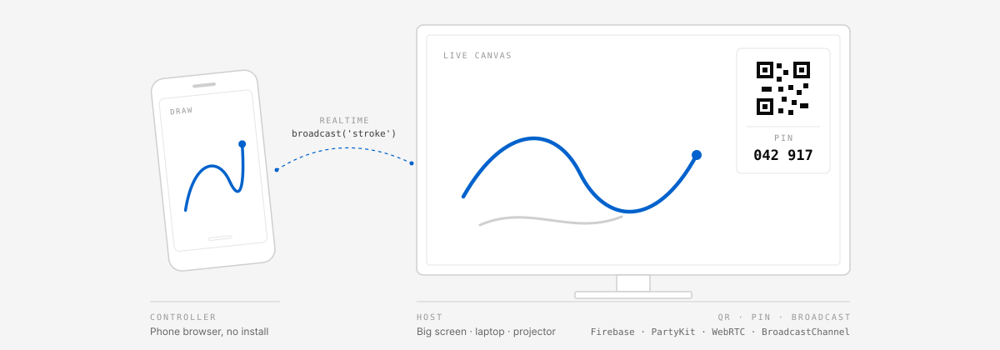
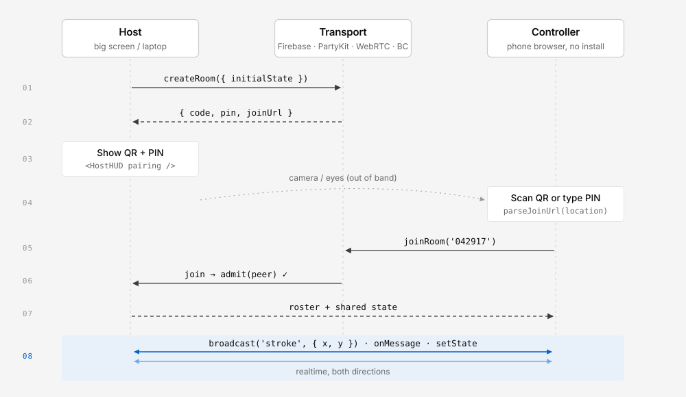
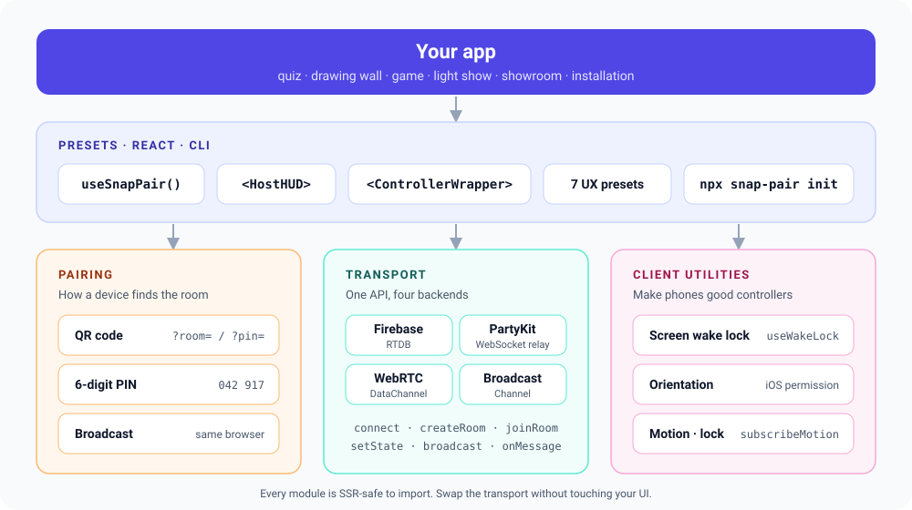
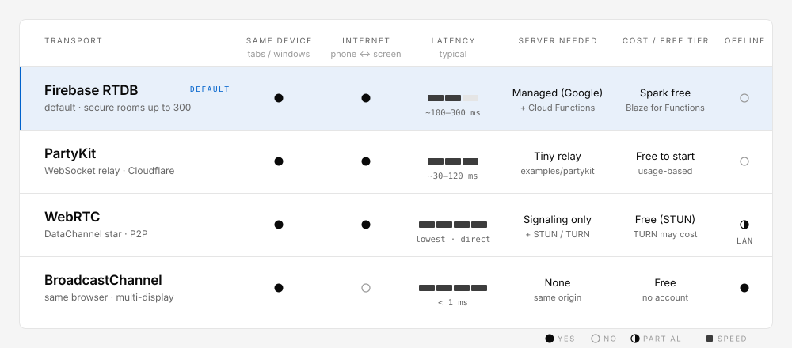
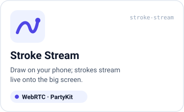
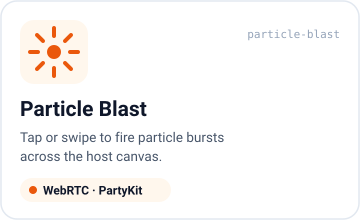
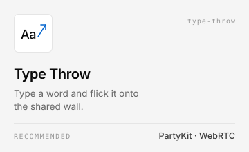
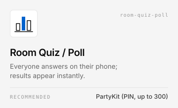
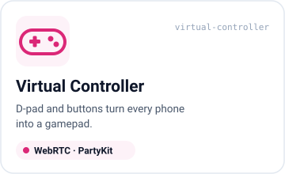
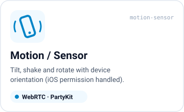

<p align="center">
  <a href="https://takaoumehara.github.io/snap-pair-skill/"><strong>📖 Documentation site →  takaoumehara.github.io/snap-pair-skill</strong></a>
  &nbsp;·&nbsp;
  <a href="https://takaoumehara.github.io/snap-pair-skill/demo.html">▶ Live two-tab demo</a>
</p>

<p align="center">
  <a href="https://takaoumehara.github.io/snap-pair-skill/"></a>
</p>

<p align="center">
  <a href="https://www.npmjs.com/package/snap-pair-core"></a>
  
  
  
  
  
</p>

<p align="center">
  <b>English</b> · <a href="https://github.com/takaoumehara/snap-pair-skill/blob/main/README.ja.md">日本語</a> · <a href="https://github.com/takaoumehara/snap-pair-skill/blob/main/README.zh-CN.md">简体中文</a> · <a href="https://github.com/takaoumehara/snap-pair-skill/blob/main/README.es.md">Español</a> · <a href="https://github.com/takaoumehara/snap-pair-skill/blob/main/README.ko.md">한국어</a>
</p>

# snap-pair

**snap-pair is a DevTool for multi-screen interactive web experiences.**
A phone becomes the controller and a big screen becomes the host. People pair
by scanning a QR code, typing a 6-digit PIN, or (experimentally) hearing an ultrasonic chirp in their normal browser, with
nothing to install, and every device in the room shares live input and state.

You bring the product (a quiz, a drawing wall, a game, a light show, a
showroom) and build it on top. snap-pair handles the pairing, the realtime
transport and the phone-side details that are easy to get wrong.

- **Pairing:** QR code, 6-digit PIN, local broadcast between tabs, or experimental ultrasonic sound (Proximity).
- **Transport:** Firebase Realtime Database, PartyKit, WebRTC DataChannel or
  BroadcastChannel, all behind one `Transport` API.
- **Client utilities:** screen wake lock, device orientation and motion
  (including the iOS permission prompt), screen orientation lock.
- **7 UX presets** and a CLI (`npx snap-pair init`) that scaffolds a working app.

The npm package is **`snap-pair-core`** (MIT).

## Contents

- [Quick start](#quick-start)
- [How devices connect](#how-devices-connect)
- [Transports and when to use which](#transports-and-when-to-use-which)
- [Presets](#presets)
- [CLI](#cli)
- [API overview](#api-overview)
- [For everyone (non-engineers)](#for-everyone-non-engineers)
- [Firebase setup](#firebase-setup)
- [Security model](#security-model)
- [AI agent skill](#ai-agent-skill)
- [FAQ](#faq)
- [Roadmap](#roadmap)

---

## Quick start

```bash
# 1. Scaffold a new app with the interactive wizard (en/ja)
npx snap-pair init

#    …or non-interactively (CI, AI agents)
npx snap-pair init --yes --preset room-quiz-poll --out my-quiz

# 2. Or add the library to an existing React app
npm i snap-pair-core
```

<details>
<summary>pnpm / yarn / bun</summary>

```bash
pnpm add snap-pair-core
yarn add snap-pair-core
bun add snap-pair-core
```

</details>

Peer dependencies: `react` (18.2+). Optional: `qrcode` (QR rendering in
`HostHUD`), `partysocket` (a sturdier PartyKit socket) and `react-dom` (only
the generated templates use it).

The smallest possible multi-screen app needs no server at all. It pairs two
tabs in the same browser with a PIN:

```ts
import { BroadcastChannelTransport } from 'snap-pair-core';

// Tab 1: the host (big screen)
const host = new BroadcastChannelTransport({ pairing: 'pin' });
await host.connect();
const { pairing } = await host.createRoom({ initialState: { strokes: [] } });
console.log('PIN', pairing.pin); // e.g. '042917'
host.onMessage((m) => draw(m.payload)); // m.type === 'stroke'

// Tab 2: the controller
const ctrl = new BroadcastChannelTransport({ pairing: 'pin' });
await ctrl.connect();
await ctrl.joinRoom('042917');
await ctrl.broadcast('stroke', { x: 0.42, y: 0.17 });
```

Swap `BroadcastChannelTransport` for `PartyKitTransport` (or
`WebRTCTransport`) and the same code works across the internet.
`FirebaseTransport` shares room state but has no ephemeral messaging, so
`broadcast` is not available there (see [Transports](#transports-and-when-to-use-which)).
[Try it live in two tabs →](https://takaoumehara.github.io/snap-pair-skill/demo.html)

---

## How devices connect

<p align="center">
  
</p>

| Method | What the guest does | Works with | Helpers |
|---|---|---|---|
| **QR code** | Scans with the camera; the URL carries `?room=` or `?pin=` | All transports | `buildPairingJoinUrl`, `parseJoinUrl`, `useQrRenderer`, `HostHUD` |
| **6-digit PIN** | Types `042 917` (full-width digits and dashes are normalized) | PartyKit, WebRTC, BroadcastChannel | `generatePin`, `normalizePin`, `isValidPin`, `verifyPin` |
| **Ultrasonic sound (Proximity)** | Host emits ~18–20 kHz FSK; phone listens on mic | PartyKit, WebRTC, BroadcastChannel (experimental) | `encodeSoundToken`, `decodeSoundToken`, `startSoundEmitter`, `startSoundListener`, `useSoundPairing` |
| **Room code** | Types a 6-character code like `ABC 234` (no look-alike characters) | All transports (Firebase's default) | `normalizeRoomCode`, `generateRoomCode` |
| **Broadcast** | Opens another tab/window on the same machine | BroadcastChannel | `BroadcastChannelTransport` |

The host shows everything with one component:

```tsx
import { HostHUD, useQrRenderer } from 'snap-pair-core';

const renderQr = useQrRenderer(); // undefined if `qrcode` isn't available, so the HUD shows the code only
<HostHUD pairing={pairing} renderQr={renderQr} peerCount={peers.length} status={status} />;
```

---

> **Sound pairing limitations:** experimental Proximity mode. Needs microphone permission on the guest, a speaker that can produce ~18–20 kHz, and a relatively quiet room. Chrome/Edge work best; Safari is uneven. The tone is not a secret — anyone nearby can recover the token; use `admit` for gated rooms. Prefer QR or PIN in production.

## Transports and when to use which

<p align="center">
  
</p>

<p align="center">
  
</p>

| If you need… | Use | Why |
|---|---|---|
| Shared-state apps (turn-based games, checklists, lobbies) with server-checked joins (up to 300), auth and persistence | **Firebase** (`useSnapPair` default) | Cloud Functions admit every guest; RTDB rules limit what members can write. Shared state only: no ephemeral messaging |
| Input from phones over the internet, rooms up to hundreds, simple deploy | **PartyKit** | A tiny WebSocket relay ([`examples/partykit/`](./examples/partykit/)); the host's browser owns the room |
| The lowest latency (drawing, games, motion) | **WebRTC** | Peer-to-peer DataChannels; signaling rides on PartyKit (or any transport with messaging) |
| Several windows or displays on **one** machine, offline | **BroadcastChannel** | No network, no server, no account |

All four implement the same `Transport` interface (`connect`, `createRoom`,
`joinRoom`, `setState`, `send`, `broadcast`, `onMessage`, `onPeers`,
`onState`, `onStatus`…), so switching is a one-line change. Check
`transport.capabilities` (`messaging`, `presence`, `serverAuthoritativeJoin`)
when your UI needs to degrade gracefully.

> **Firebase has no ephemeral messaging.** `FirebaseTransport` reports
> `capabilities.messaging === false` and rejects `send`/`broadcast`, and
> `setState` replaces the whole state object, so concurrent writers would
> clobber each other. All seven presets stream input, so none of them runs on
> Firebase. When you pick Firebase, `npx snap-pair init` offers two options: a
> config-only Firebase app (`preset: null`, shared state through
> `useSnapPair`), or Firebase for your app plus PartyKit for the preset's
> realtime messages.

```ts
import { PartyKitTransport, WebRTCTransport, FirebaseTransport } from 'snap-pair-core';

const party = new PartyKitTransport({ host: 'my-relay.me.partykit.dev', pairing: 'pin' });
const p2p = new WebRTCTransport({ signaling: party }); // DataChannel star, host in the middle
const fb = new FirebaseTransport({ db, auth, functions }); // server-authoritative rooms, shared state only
```

WebRTC reconnects on its own (ICE restart on the same connection, then
re-offers with exponential backoff) and splits frames over 16 KiB into chunks
(up to 1 MiB per message). Pass `reconnect: false` to turn recovery off.

---

## Presets

Seven ready-made UX patterns. Each one has a template you can scaffold with
`npx snap-pair init`, a recommended transport, message shapes and a rate
limit the template stays under (`PRESETS` / `getPreset(id)` expose all of it).

<table>
  <tr>
    <td width="33%" align="center"></td>
    <td width="33%" align="center"></td>
    <td width="33%" align="center"></td>
  </tr>
  <tr>
    <td align="center"></td>
    <td align="center"></td>
    <td align="center"></td>
  </tr>
  <tr>
    <td align="center"></td>
    <td colspan="2" valign="middle">
      <b>Preset ids</b> (for the CLI and <code>snap-pair.config.json</code>):<br><br>
      <code>stroke-stream</code> · <code>particle-blast</code> · <code>type-throw</code> · <code>room-quiz-poll</code> · <code>virtual-controller</code> · <code>motion-sensor</code> · <code>local-multi-display</code>
    </td>
  </tr>
</table>

| Preset | id | Host shows | Phone sends (rate limit) | Transports (**recommended** first) | Pairing (default first) |
|---|---|---|---|---|---|
| Stroke Stream | `stroke-stream` | Shared canvas | `stroke` batches (≤30/s) | **WebRTC** · PartyKit · BroadcastChannel | QR · code · PIN |
| Particle Blast | `particle-blast` | Particle field | `blast` taps / swipes (≤10/s) | **PartyKit** · WebRTC · BroadcastChannel | QR · PIN · code |
| Type Throw | `type-throw` | Word wall | `throw` short text (≤2/s) | **PartyKit** · WebRTC · BroadcastChannel | QR · PIN · code |
| Room Quiz / Poll | `room-quiz-poll` | Question + live tally | `vote` (once per question) | **PartyKit** · BroadcastChannel · WebRTC | PIN · QR · code |
| Virtual Controller | `virtual-controller` | The game | `input` d-pad / buttons (≤60/s, on change) | **WebRTC** · PartyKit · BroadcastChannel | QR · code · PIN |
| Motion / Sensor | `motion-sensor` | Scene driven by tilt | `motion` orientation (≤30/s) | **WebRTC** · PartyKit · BroadcastChannel | QR · code · PIN |
| Local Multi-Display | `local-multi-display` | One scene across windows | `tick`, `hello` (≤60/s) | **BroadcastChannel** | broadcast |

Firebase is not listed for any preset; see the note under
[Transports](#transports-and-when-to-use-which). Templates send controller
input to the host only (`send({ to: hostId })`), keep the host as the only
state writer (`allowGuestState: false`) and clamp every payload on the host.

---

## CLI

```bash
npx snap-pair init                                    # interactive wizard (default command)
npx snap-pair init --yes --preset room-quiz-poll --out my-quiz
npx snap-pair init --yes --preset virtual-controller --transport webrtc --json
npx snap-pair init --yes --architecture managed --no-scaffold   # Firebase config only
npx snap-pair presets                                 # list the 7 presets (--json for the registry)
npx snap-pair recommend "a tilt racing game for 4 friends"
```

The wizard speaks English or Japanese (from `LANG` / `LC_ALL`, or `--lang
en|ja`) and offers four ways in (`--path` skips the menu):

| Path (`--path`) | You answer | You get |
|---|---|---|
| **1. By experience** (`ux`) | Which of the 7 presets feels right | That preset, then a transport it supports (recommended first) |
| **2. By architecture** (`architecture`) | Same device, realtime, P2P, or managed | A transport, then the presets that fit it |
| **3. By stack** (`stack`) | What you already have: Firebase, Cloudflare/PartyKit, or no backend | A transport built around your stack |
| **4. Describe it** (`consult`) | A sentence in English or Japanese, e.g. "audience votes on a stage screen" | A rule-based recommendation you can accept or adjust |

Each transport option prints a summary, pros, cons and a cost line with
free-tier notes. Picking Firebase offers a config-only Firebase app or
Firebase plus PartyKit for the preset's realtime messages. Non-interactively:
`--yes --architecture managed --no-scaffold` writes the Firebase-only config,
and `--yes --stack firebase --preset <id>` keeps your Firebase app and puts
the preset on PartyKit (`--transport firebase --preset <id>` is rejected).

Every path writes **`snap-pair.config.json`** and scaffolds a Vite + React
template (host and controller in one app, picked by URL), plus a PartyKit
relay (`party/server.ts`) when the transport needs one:

```json
{
  "$schema": "./node_modules/snap-pair-core/dist/config.schema.json",
  "version": 1,
  "preset": "room-quiz-poll",
  "transport": "partykit",
  "pairing": "pin",
  "locale": "en",
  "maxPlayers": 300,
  "partykit": { "host": "", "party": "main" }
}
```

| Flag | Meaning |
|---|---|
| `--preset <id\|none>` | One of the 7 preset ids, or `none` |
| `--transport <t>` | `broadcast` \| `partykit` \| `webrtc` \| `firebase` |
| `--pairing <m>` | `qr` \| `code` \| `pin` \| `broadcast` |
| `--architecture <a>` | `same-device` \| `realtime` \| `p2p` \| `managed` |
| `--stack <s>` | `firebase` \| `cloudflare` \| `none` |
| `--describe <text>` | Free-text idea for the `consult` path |
| `--out <dir>` | Target folder (default: `./snap-pair-<preset>`) |
| `--partykit-host <h>`, `--max-players <n>` | Written into the config (`maxPlayers`: 2–300) |
| `--no-scaffold`, `--force` | Config only; overwrite existing files |
| `-y, --yes` | Accept every default (non-interactive) |
| `--json` | JSON result on stdout (`config`, `files`, `nextSteps`); messages go to stderr |
| `--lang <en\|ja>` | Language |

Re-run the command any time to change your choices.

---

## API overview

Everything is exported from `snap-pair-core` (ESM and CJS, with types).
Subpath entries share the same classes as the root:

| Import path | Contents |
|---|---|
| `snap-pair-core` | Everything below, plus presets, i18n and the room server |
| `snap-pair-core/hooks/useSnapPair` | `useSnapPair` only (the old `snap-pair-core/src/hooks/useSnapPair` path still works) |
| `snap-pair-core/transports/{base,firebase,partykit,webrtc,broadcast}` | One transport each |
| `snap-pair-core/config.schema.json` | JSON Schema for `snap-pair.config.json` |
| `snap-pair` (bin) | The CLI: `npx snap-pair` |

### React: `useSnapPair`

```tsx
import { useState } from 'react';
import { PartyKitTransport, useSnapPair } from 'snap-pair-core';

// Firebase (default): server-assisted rooms
const sp = useSnapPair({ db, auth, functions, guest: { id: '', name: 'Ada' }, maxPlayers: 8 });

// Any other transport: pass an instance (you own it) or a factory (the hook owns it)
const [party] = useState(() => new PartyKitTransport({ host: 'my-relay.me.partykit.dev', pairing: 'pin' }));
const sp = useSnapPair({ transport: party, guest: { id: '', name: 'Ada' } });

const { room, authReady, createRoom, joinRoom, updateState, updateOwnPlayer, updateRoomStatus, leaveRoom } = sp;
```

Wait for `authReady` before calling `createRoom(initialState)` or
`joinRoom(code)`. Both modes return the same shape. With a transport,
`authReady` follows the connection, `localGuest.id` becomes the transport's
peer id, and you use the instance's `send` / `broadcast` / `onMessage` for
ephemeral input. Keep an instance stable (`useState(() => new X())`); a
factory (`transport: () => new X()`) is created once and disconnected on
unmount. The mode is fixed for a component's lifetime. With Firebase, members
may update shared `state`, their own `name`, `connected` and `lastSeenAt`, and
only the host may change the room status.

### Transports

| Export | Notes |
|---|---|
| `Transport` | Abstract base: `connect` / `disconnect`, `createRoom` / `joinRoom` / `leaveRoom`, `setState`, `send` / `broadcast`, `on*` subscriptions that return an idempotent unsubscribe, and `capabilities` |
| `FirebaseTransport`, `FirebaseRoomStore` | RTDB + callable Cloud Functions; `serverAuthoritativeJoin: true` |
| `PartyKitTransport` | Options: `host`, `party`, `pairing`, `socketFactory` (inject `partysocket` in bundled apps), `connectTimeoutMs`. Falls back to `WebSocket` with backoff |
| `WebRTCTransport` | Options: `signaling` (any transport with messaging), `iceServers` (default: one public STUN), `connectTimeoutMs`, `reconnect` (`false` or `{ maxAttempts, baseDelayMs, maxDelayMs, iceRestartGraceMs }`), `maxMessageBytes` (16 KiB), `maxReassembledBytes` (1 MiB) |
| `BroadcastChannelTransport` | Same-origin tabs/windows; `isBroadcastChannelSupported()` |
| `RelayTransport` | Shared host-authoritative engine behind the last three. Common options: `pairing: 'code' \| 'pin'`, `maxPlayers`, `admit(peer)`, `namespace`, `joinBaseUrl`, `heartbeatMs`, `peerTimeoutMs`, `allowGuestState` |

### Pairing

| Export | Notes |
|---|---|
| `generatePin()`, `normalizePin()`, `isValidPin()`, `formatPin()`, `verifyPin()` | Uniform 6-digit PINs (`crypto.getRandomValues`), constant-time verify |
| `deriveRoomId()`, `deriveChannelName()` | Hash a code or PIN into a namespaced room key; works on plain-HTTP LAN origins too |
| `buildPairingJoinUrl()`, `parseJoinUrl()` | `?pin=` / `?room=` join links |
| `useQrRenderer()`, `createQrRenderer()`, `toQrDataUrl()`, `loadQrLib()` | QR rendering via the optional `qrcode` package |
| `generateRoomCode()`, `normalizeRoomCode()`, `ROOM_CODE_ALPHABET` | 6-character, look-alike-free room codes |

### Client utilities

| Export | Notes |
|---|---|
| `useWakeLock(enabled)`, `createWakeLock()`, `isWakeLockSupported()` | Keeps a controller screen on; re-acquires when the tab becomes visible |
| `needsPermission()`, `requestOrientationPermission()` | iOS 13+ permission prompt; call from a tap handler. Resolves `'granted' \| 'denied' \| 'unsupported'` |
| `subscribeOrientation()`, `subscribeMotion()` | `alpha/beta/gamma` and acceleration readings |
| `lockScreenOrientation()`, `unlockScreenOrientation()`, `getScreenOrientation()` | Screen orientation lock where supported |

```ts
button.onclick = async () => {
  if (needsPermission() && (await requestOrientationPermission()) !== 'granted') return;
  const stop = subscribeOrientation(({ beta, gamma }) => transport.broadcast('tilt', { beta, gamma }));
};
```

Every client utility feature-detects at call time and degrades to a no-op, so
it is safe to import during SSR.

### Components

| Export | Notes |
|---|---|
| `HostHUD` | Host pairing panel: QR (via `renderQr`), room code, PIN, join link with copy button, peer count, status. `locale="en" \| "ja" \| "auto"`; every string can be overridden with `labels` |
| `ControllerWrapper` | Phone-side shell: status bar, reconnect banner, wake lock toggle, iOS motion permission button, fullscreen + orientation lock. Each control hides itself where the browser lacks the API |

```tsx
import { ControllerWrapper } from 'snap-pair-core';

<ControllerWrapper
  transport={party}            // or status={status}
  roomCode={room?.code}
  onReconnect={() => joinRoom(code)}
  motion                       // shows the iOS permission button until granted
  orientation="portrait"       // fullscreen button that also locks orientation
  locale="auto"                // 'en' | 'ja' | 'auto'; override strings with labels
>
  {({ status, motionPermission }) => <Pad disabled={status !== 'connected' || motionPermission !== 'granted'} />}
</ControllerWrapper>;
```

`wakeLock` defaults to `true`; `onMotionPermission`, `className` and `style`
are also accepted.

### Presets and i18n

`PRESETS`, `getPreset(id)`, `supportedTransports(preset)`, `pairingFor(preset,
transport)` and `presetsForTransport(transport)` expose the preset registry
the CLI uses. `createTranslator(locale)`, `t()`, `detectLocale()` and
`SUPPORTED_LOCALES` (`en`, `ja`) are the bundled dictionaries behind the CLI,
`HostHUD` and `ControllerWrapper`.

<details>
<summary><b>Firebase data layout and room server</b></summary>

```text
pairingCodes/{code}                 # Admin SDK only
roomMembers/{roomId}/{uid}: true    # Admin SDK only; client cannot read/write
roomCreationLimits/{uid}            # Admin SDK only; fixed-hour create quota
rooms/{roomId}/meta
rooms/{roomId}/players/{uid}
rooms/{roomId}/state
rooms/{roomId}/joinState            # Admin SDK only
```

- Callable Cloud Functions (`functions/src/`): `createSnapRoom`,
  `joinSnapRoom`, and a scheduled `cleanupExpiredData`.
- Security rules (`database.rules.json`): membership-gated reads and narrow
  client writes, with no broad room-level write.
- `state` is intentionally generic. It does not validate a product schema or
  limit payload size and write rate. Every product must add validation,
  payload limits and throttling before going to production.

Design notes: [docs/plan-phase1.md](./docs/plan-phase1.md),
[docs/plan-phase2.md](./docs/plan-phase2.md),
[docs/plan-phase3.md](./docs/plan-phase3.md).

</details>

---

## For everyone (non-engineers)

**What is this?** A way to make many people's phones join one shared screen
instantly. Everyone scans a QR code (or types a short code) in their normal
browser, with no app to download, and their phones become part of one live,
synchronized experience.

**Who is it for?** People who run **events, venues, classes, streams,
showrooms or exhibitions** and want the audience to take part with their own
phones, and the **engineers and AI builders** who make those experiences.

**What can you build?** Live votes, polls and quizzes on a big screen; group
checklists and "everyone's ready" checks; audience reactions, prediction
games and collaborative drawing; a synchronized phone light show; any "one
shared screen + many phones + instant result" moment.

### Pick one path

These are three separate paths, not steps of one process. Pick the one that
matches what you want right now.

| | **A. Just see it work** | **B. Have an AI build my app** | **C. Work with the source** |
|---|---|---|---|
| **For** | "Show me in 2 minutes" | "I want a custom app without writing code" | "I'm an engineer and want to read, modify or contribute" |
| **Install** | Nothing | One AI coding tool | An AI coding tool **and** Git/Node.js |
| **Download** | Nothing (or one HTML file) | **Nothing**: the AI reads the instructions from the web | The repository |
| **Credit card?** | No | Depends on the backend (see [Firebase setup](#firebase-setup)) | Depends on the backend |
| **Share a link?** | Same browser / same network | Yes, once deployed | Yes, once deployed |
| **Go to** | [Path A](#path-a-just-see-it-work) | [Path B](#path-b-have-an-ai-build-your-app) | [Path C](#path-c-work-with-the-source) |

#### Path A: Just see it work

- **In your browser, right now:** open the
  [live demo](https://takaoumehara.github.io/snap-pair-skill/demo.html) in two
  tabs. One is the host and shows a PIN; type it into the other and draw.
  Nothing to set up.
- **Across two phones:** download
  [`examples/snap-pair-lite.html`](./examples/snap-pair-lite.html), open it,
  and scan the QR code with a second device. It's a fixed tic-tac-toe demo
  running on the free Firebase Spark plan with no credit card (see
  [`examples/README.md`](./examples/README.md)).

#### Path B: Have an AI build your app

You do **not** need to download or clone this repository. Connecting two
small tools (MCP servers) is enough, plus telling the AI to read this
project's build instructions from the web.

**You need** one AI coding tool that can run commands and fetch web pages:
Claude Code, Cursor, Codex, Gemini CLI or similar. Don't have one? Pick one:
[Cursor](https://cursor.com) (an editor with AI built in), **Claude Code**
(VS Code extension or the CLI from [claude.com/code](https://claude.com/code)),
or **Codex** / **Gemini CLI**.

1. Open a chat in your AI tool in any folder (an empty folder is fine).
2. Paste this, as-is:

   ```
   Fetch https://raw.githubusercontent.com/takaoumehara/snap-pair-skill/main/SKILL.md
   and use it as your build instructions.

   Connect these two MCP servers if they aren't connected yet:
   - firebase: npx -y firebase-tools@latest mcp
   - snap-pair-provisioner: npx -y snap-pair-provisioner

   Then help me build: [describe what you want, e.g. "a live quiz game where
   guests join by QR code and answer on their phones"].
   ```

3. Answer the AI's questions as they come up. It will ask which Google account
   to use for Firebase and, at one point, show a one-time sign-in link. That
   click is the only manual step, by design, for your account's safety.

If your tool cannot fetch web pages, download just
[`SKILL.md`](./SKILL.md) and paste its contents into the chat instead.

#### Path C: Work with the source

```bash
git clone https://github.com/takaoumehara/snap-pair-skill.git
cd snap-pair-skill
npm install
npm test
```

Then read the [API overview](#api-overview) and the design notes in
[`docs/`](./docs/).

---

## Firebase setup

Only needed for the Firebase transport. PartyKit, WebRTC and
BroadcastChannel don't use Firebase at all.

| Your goal | Use | Credit card? | Others can join by URL? |
|---|---|---|---|
| Learn, experiment, let a child build and test | **Firebase Emulator** (on your computer) | **No** | No, local only |
| Free public demo, open rules, small groups | **Spark plan** + Lite mode ([`examples/`](./examples/)) | **No** | Yes (up to 100 simultaneous connections) |
| Real guests with server-checked rooms | **Blaze plan** | **Yes** | Yes |

### 1. Emulator: free, no card, local only

```bash
npm install
npm --prefix functions install
npm --prefix functions run build
npx firebase-tools emulators:start --only auth,database,functions
```

### 2. Spark (free): what it can and can't do

Spark needs no card, serves a public site with Firebase Hosting and allows
Realtime Database with a hard cap of **100 simultaneous connections**.
**Spark cannot deploy Cloud Functions**, and snap-pair's secure mode relies on
them for room creation and joining. Use it for Lite mode, or pick another
transport.

### 3. Blaze (pay-as-you-go): required for secure mode (card needed)

Blaze keeps the free quotas (about **2,000,000 function invocations/month**;
RTDB up to 200,000 simultaneous connections) and only bills beyond them, so
a small event often costs nothing. The card must be on file to enable it.

```bash
npm --prefix functions run build
firebase use YOUR_EXISTING_PROJECT
firebase deploy --only functions
firebase deploy --only database
```

Both callables enforce Firebase App Check. Configure a debug token for local
development against a real project, and never disable enforcement in the
deployed callable. **Set a budget alert** in Firebase console → Usage and
billing (alerts notify; they do not hard-cap charges).

The MCP servers from Path B create the project, enable services and write
your `.env` for you. See
[`SKILL.md`](./SKILL.md#firebase-setup-mcp-automation-vs-manual) for what is
automatic and what stays a one-time manual step.

---

## Security model

- **A pairing code locates a room. It is not a password.** Treat QR codes,
  room codes and PINs as rendezvous handles.
- **Firebase (secure mode)** is server-authoritative: Firebase Auth
  identifies each browser, Cloud Functions create rooms and admit
  participants, and RTDB rules let only admitted members read or update
  narrowly scoped fields. IDs, roles, membership, capacity, pairing codes and
  `joinState` stay server-only.
- **PartyKit, WebRTC and BroadcastChannel** are host-authoritative: the
  browser that created the room owns the roster and state, and nothing on a
  server admits peers (`capabilities.serverAuthoritativeJoin === false`).
  Gate entry with `admit(peer)` and `maxPlayers`. Room keys are hashed and
  namespaced, so raw PINs never appear in URLs or relay logs.
- A 6-digit PIN has only 10⁶ values. On a public relay, add rate limiting
  (see [`examples/partykit/`](./examples/partykit/)) and don't use PINs alone
  for anything sensitive.
- **Payments** are outside this project. If a product needs them, add a
  separate trusted server integration with membership checks and provider
  webhook verification.

---

## AI agent skill

[`SKILL.md`](./SKILL.md) teaches an AI coding agent to generate a correct
snap-pair integration and to choose a transport and preset. Point your agent
at the raw URL:

```
https://raw.githubusercontent.com/takaoumehara/snap-pair-skill/main/SKILL.md
```

or copy it into your agent's skills directory. For a private-input,
aggregate-reveal, commitment-threshold pattern, see
[`references/one-room-one-decision.md`](./references/one-room-one-decision.md).

---

## FAQ

<details>
<summary><b>Do guests need to install an app?</b></summary>

No. Guests open a URL in the browser they already have, by scanning a QR code
or typing a code.
</details>

<details>
<summary><b>Which transport should I start with?</b></summary>

Prototyping on one machine: BroadcastChannel. Phones over the internet:
PartyKit (WebRTC for the lowest latency in small rooms, ≈2–16 people).
Shared-state apps where joins must be checked on a server: Firebase (it has
no ephemeral messaging, so pair it with PartyKit for streamed input). Or run
`npx snap-pair init` (or `npx snap-pair recommend "<your idea>"`) and let the
CLI decide.
</details>

<details>
<summary><b>Do I need a credit card?</b></summary>

Not for BroadcastChannel, the Firebase Emulator, or Firebase Spark Lite mode.
Firebase's secure mode needs the Blaze plan, which needs a card, though small
events usually stay within the free quota. PartyKit has its own free tier.
</details>

<details>
<summary><b>How many people can join one room?</b></summary>

Firebase secure rooms are designed for up to 300 participants. Relay
transports are limited by `maxPlayers` and by how many connections the host
browser can handle. WebRTC uses a star around the host, which suits small
groups best.
</details>

<details>
<summary><b>Why doesn't motion work on my iPhone?</b></summary>

iOS 13+ requires a permission prompt triggered by a tap. Call
`requestOrientationPermission()` from a click handler (or use
`ControllerWrapper`, which adds the button for you). The page must be served
over HTTPS.
</details>

<details>
<summary><b>Can I use it without React?</b></summary>

Yes. Transports, pairing helpers and client utilities are plain TypeScript.
Only `useSnapPair`, `useWakeLock`, `useQrRenderer`, `HostHUD` and
`ControllerWrapper` need React. The [live demo](https://takaoumehara.github.io/snap-pair-skill/demo.html)
is plain JavaScript.
</details>

<details>
<summary><b>Does it work with Next.js and SSR?</b></summary>

Yes. No module touches `window`, `document` or `navigator` at import time.
Create transports inside effects or client components.
</details>

---

## Roadmap

- [x] **Phase 1:** `Transport` abstraction, `FirebaseTransport`, `HostHUD`
- [x] **Phase 2:** PartyKit, WebRTC and BroadcastChannel transports; PIN and
      QR helpers; wake lock and orientation utilities
- [x] **Phase 3:** `npx snap-pair init` wizard (4 paths, en/ja) with
      `presets` and `recommend` commands, 7 preset templates,
      `ControllerWrapper`, `useSnapPair({ transport })`, i18n, ESM/CJS build
      with an `exports` map, WebRTC auto-reconnect and message chunking

- [x] **Proximity pairing:** Web Audio ultrasonic FSK (`sound`) as an experimental pairing layer

Still to do:

- [ ] **WebRTC:** renegotiation (extra channels, media tracks), binary
      payloads, backpressure (`bufferedAmount`), mesh topology, host
      migration, TURN guidance, real-browser end-to-end tests
- [ ] **Bundle size:** the root `useSnapPair` imports `firebase/auth`
      statically, so non-Firebase apps still bundle it; a Firebase-free hook
      entry or lazy loading
- [ ] **Firebase:** numeric PINs and ephemeral messaging
      (`rooms/$roomId/messages`), so presets can run on it
- [ ] **i18n:** more locales; transport errors and template UI strings in
      Japanese

## Development

```bash
npm test
npm run typecheck   # library + templates
npm run build       # dist/ (ESM + CJS + d.ts), dist/cli, templates/
node dist/cli/index.js --help
npm --prefix functions test
npm --prefix functions run typecheck
npm run test:rules-emulator
```

## Automated dependency updates (AI-assisted)

- [`.github/dependabot.yml`](./.github/dependabot.yml) opens weekly update PRs
  for npm in `/`, `/functions` and `/tools/snap-pair-provisioner`, plus GitHub
  Actions. Minor and patch updates are grouped into one PR per directory; major
  updates get their own PR. All of them are labeled `dependencies`.
- [`.github/workflows/ai-update-helper.yml`](./.github/workflows/ai-update-helper.yml)
  runs [`scripts/ai-update-helper.mjs`](./scripts/ai-update-helper.mjs):
  - **On Dependabot PRs** (only when both the actor and the PR author are
    `dependabot[bot]`), it diffs `package.json` / `package-lock.json` between
    base and head (falling back to the PR body), fetches GitHub release notes
    or `CHANGELOG.md` for each package, finds `import` / `require` usages with
    `git grep`, and asks Gemini for a per-package summary, an impact verdict
    (Not affected / Possibly affected / Affected) and proposed `diff`s. The
    result is one PR comment that is updated in place on every push.
  - **Weekly (Mondays 06:00 UTC, or manually via "Run workflow")**, it
    compares each `package-lock.json` with the npm registry's latest versions
    (no `npm install` needed) and updates a single open issue titled
    "AI dependency update report".
  - If the Gemini API fails, it still posts the plain package table.

### Setup

1. Create a Gemini API key in [Google AI Studio](https://aistudio.google.com/apikey).
2. Add it as `GEMINI_API_KEY` in **both** places under
   *Settings → Secrets and variables*:
   - **Actions** (used by the weekly run), and
   - **Dependabot** (workflow runs triggered by Dependabot can only see
     Dependabot secrets).

   With the GitHub CLI:

   ```bash
   gh secret set GEMINI_API_KEY
   gh secret set GEMINI_API_KEY --app dependabot
   ```

3. Optional: set a repository **variable** `GEMINI_MODEL` (*Settings → Secrets
   and variables → Actions → Variables*) to choose the model. The default is
   `gemini-3.5-flash`. Gemini 1.5 Flash is retired, so don't use it.

Without `GEMINI_API_KEY` the script logs a notice and exits successfully. The
workflow never fails just because the key is missing.

**Permissions.** The workflow sets `permissions: {}` at the top level and grants
each job only what it needs: `contents: read` + `pull-requests: write` for the
PR job, and `contents: read` + `issues: write` for the weekly job. The API key
goes in the `x-goog-api-key` header, never in the URL or the logs.

**Run locally.** This prints the Markdown instead of writing to GitHub:

```bash
# Weekly report (queries the npm registry; without a key it prints only the table)
node scripts/ai-update-helper.mjs --dry-run
# PR analysis for a local commit range
node scripts/ai-update-helper.mjs --dry-run --mode pr --base origin/main --head HEAD
```

> **Review AI suggestions before merging.** The verdicts and diffs are
> generated by an LLM from release notes and grep results. They can be
> incomplete or wrong. Treat them as a starting point, and rely on CI and your
> own review.

## License

MIT. See [LICENSE](./LICENSE).
